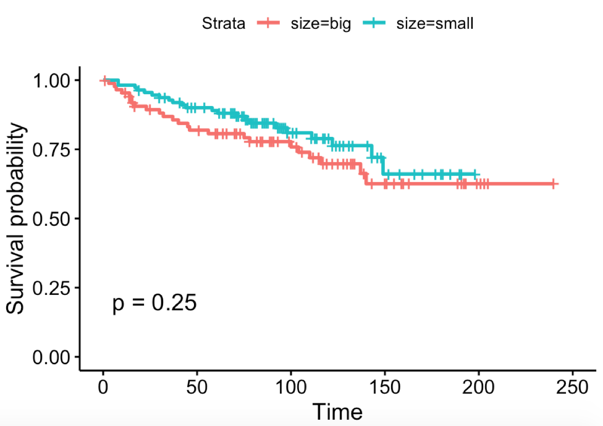
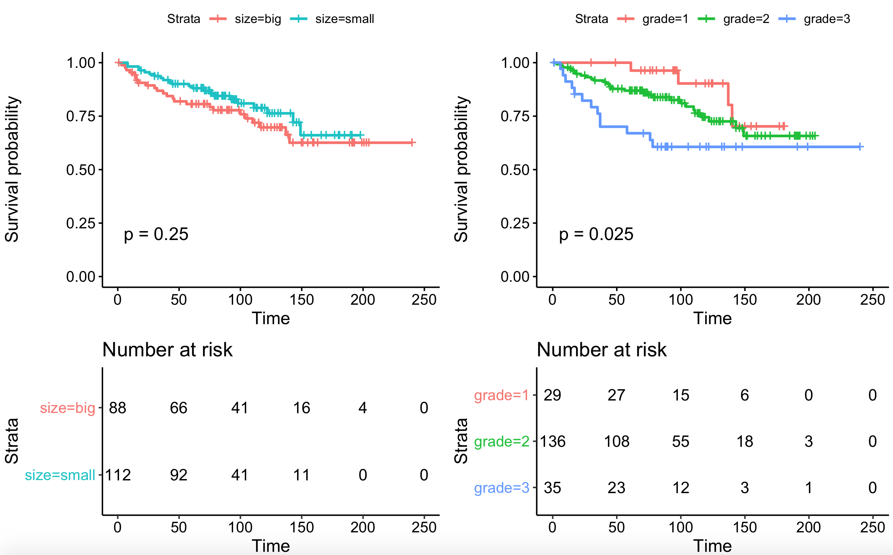
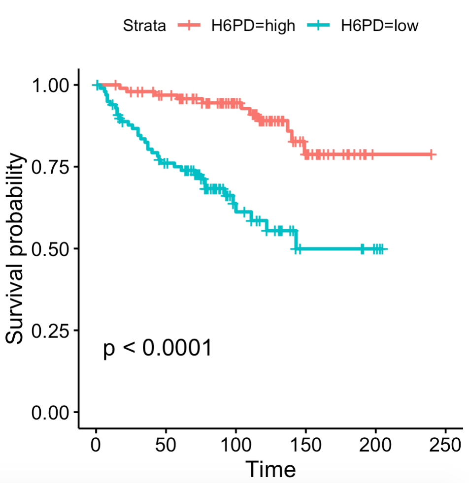

# 演示生存分析

选择这个数据集，主要是为了演示生存分析的操作，尤其是批量对所有基因的表达量进行分组后的生存分析，包括KM和COX的。

但是大家使用的时候需要注意两点：

- 首先有些基因在所有样本的表达量是恒定的，比如基因在所有样本均不表达，所以值为0，那样，对于这个基因来说，它就不能把病人区分成为两个组进行生存分析的比较。
- 然后 [apply家族函数和for循环还是有区别的（批量生存分析出图bug）](https://mp.weixin.qq.com/s/efI8U2lb3UfMwLp94iqw1Q)

代码很简单， 同样是使用GEOquery包下载数据集，然后提取**生存分析相关的表型**信息，如下：

```
> head(phe)
  event grade node  size time
1     1     2    0 small   92
2     0     3    0   big   71
3     1     3    0 small   58
4     0     2    0 small   68
5     0     2    0   big  103
6     0     2    0 small   93
```

**有了表型数据，即可做生存分析**，这个时候并不需要表达矩阵，因为不需要根据基因进行分组：

```r
library(survival)
library(survminer)
# 利用ggsurvplot快速绘制漂亮的生存曲线图
sfit <- survfit(Surv(time, event)~size, data=phe)
sfit
summary(sfit)
ggsurvplot(sfit, conf.int=F, pval=TRUE)
```

可以看到 size 这个临床表型，跟病人生存的关系并不显著。



然后我们**联合多个表型合并**绘制生存分析曲线：

```r
## 多个 ggsurvplots作图生存曲线代码合并代码公布
sfit1=survfit(Surv(time, event)~size, data=phe)
sfit2=survfit(Surv(time, event)~grade, data=phe)
splots <- list()
splots[[1]] <- ggsurvplot(sfit1,pval =TRUE, data = phe, risk.table = TRUE)
splots[[2]] <- ggsurvplot(sfit2,pval =TRUE, data = phe, risk.table = TRUE)
# Arrange multiple ggsurvplots and print the output
arrange_ggsurvplots(splots, print = TRUE,  ncol = 2, nrow = 1, risk.table.height = 0.4)
# 可以看到grade跟生存显著相关，而size病人生存的关系并不显著。
```

如图：



针对全部基因进行分组后批量走生存分析，代码见 [step5-survival.R](./step5-survival.R) 希望你可以抽出**10个小时以上时间**弄懂我的代码，应用到你的数据集。

### 留给你一个课题

值得注意的是，我在代码里面，给大家展示了PCA的第二个PC其实是可以区分病人的grade，而且我们的生存分析，也可以发现很多跟预后相关的基因，比如：



同样的，我们的基因表达矩阵，可以使用WGCNA算法拿到跟grade相关的基因集模块。

两个基因集取交集，得到的最后的基因集加上一点点实验验证，就是一篇很棒的paper哦。

大家加油，发文章了记得请我吃饭哈！