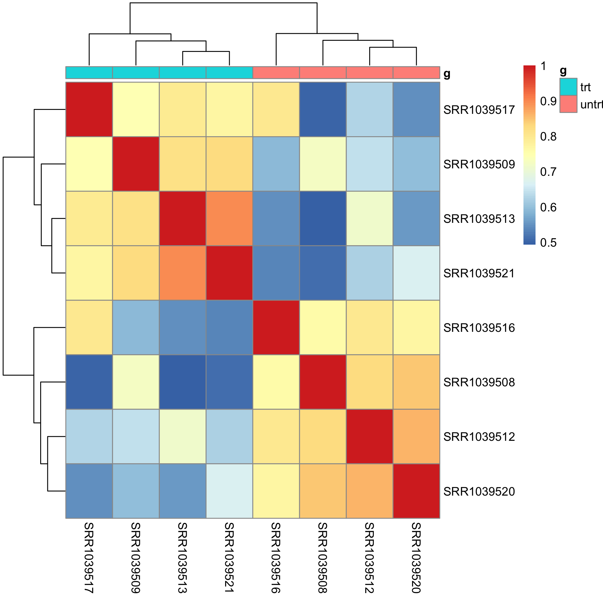

# A brief example for RNA-seq data analysis 

Firstly you should read the paper more than 3 times. 

> [PLoS One.](https://www.ncbi.nlm.nih.gov/pubmed/24926665#) 2014 Jun 13;9(6):e99625. doi: 10.1371/journal.pone.0099625. eCollection 2014.
>
> RNA-Seq transcriptome profiling identifies CRISPLD2 as a glucocorticoid responsive gene that modulates cytokine function in airway smooth muscle cells.

In that paper, we can find the raw data of this experiment, which is located in :  https://www.ncbi.nlm.nih.gov/geo/query/acc.cgi?acc=GSE52778 

If you are familar with RNA-seq workflow , you can process those data from begin to end, get the expression matrix by your self, but you can also load the expression matrix by R package: `airway` 

The readme for this package: https://bioconductor.org/packages/release/data/experiment/vignettes/airway/inst/doc/airway.html 

### check the correlation of expression matrix

As we can see, the samples in same group are more similar with each other than samples in different group.

### DEG script 

It's very easy to understand, so I don't want to explain the codes one by one. 

You can also read my tutorial `rnaseq-workflow.txt` to study how to process the raw fastq data of RNA-seq.

The R code : [DEG_rnsseq.R](DEG_rnsseq.R)

### annotation 

Once we get the DEG list, we can annotate those genes.

