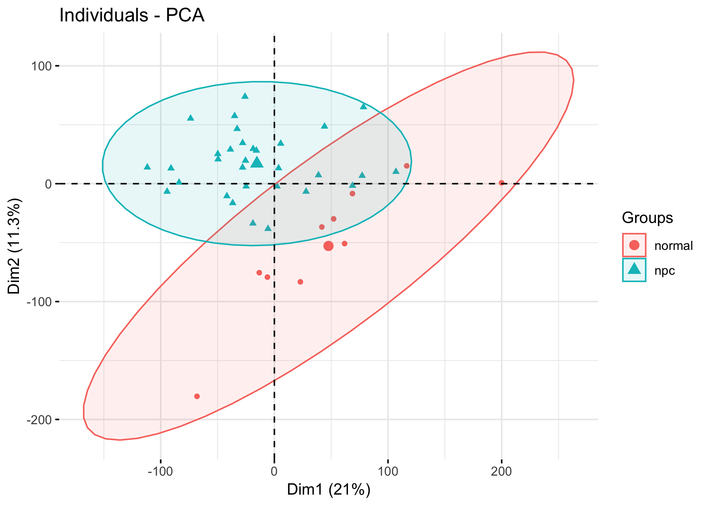
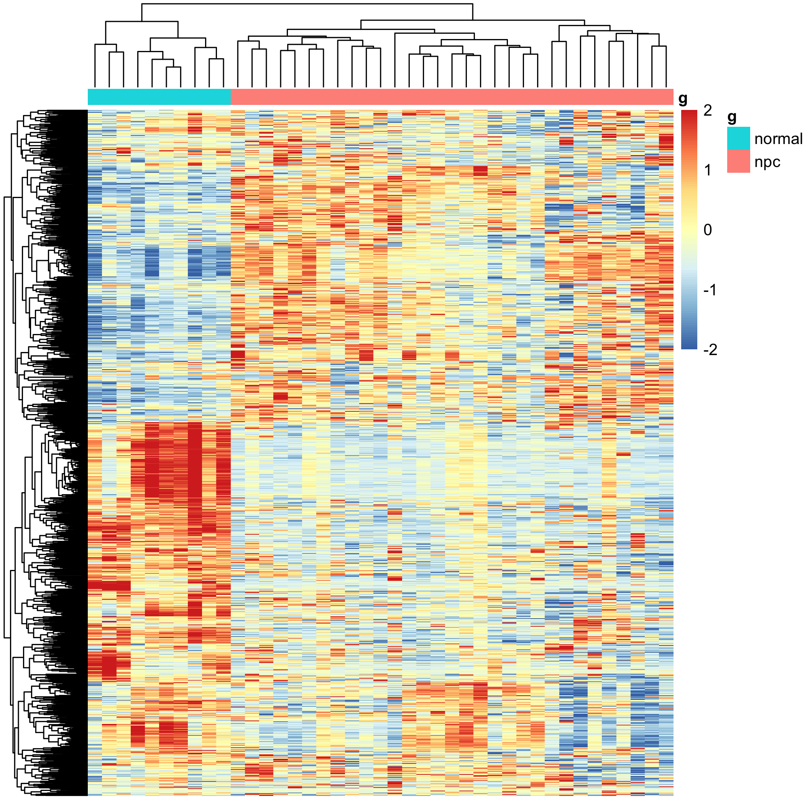
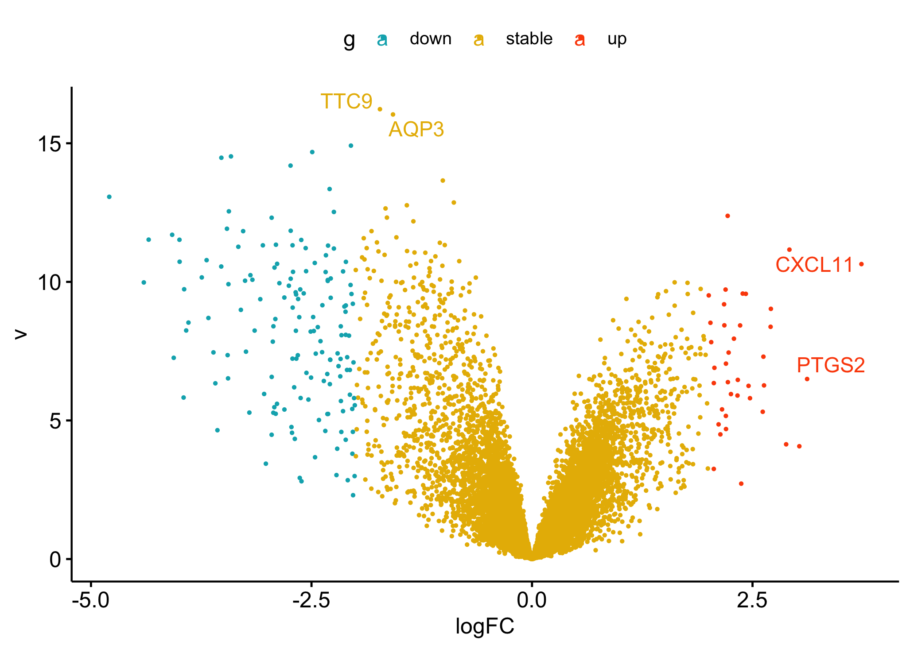
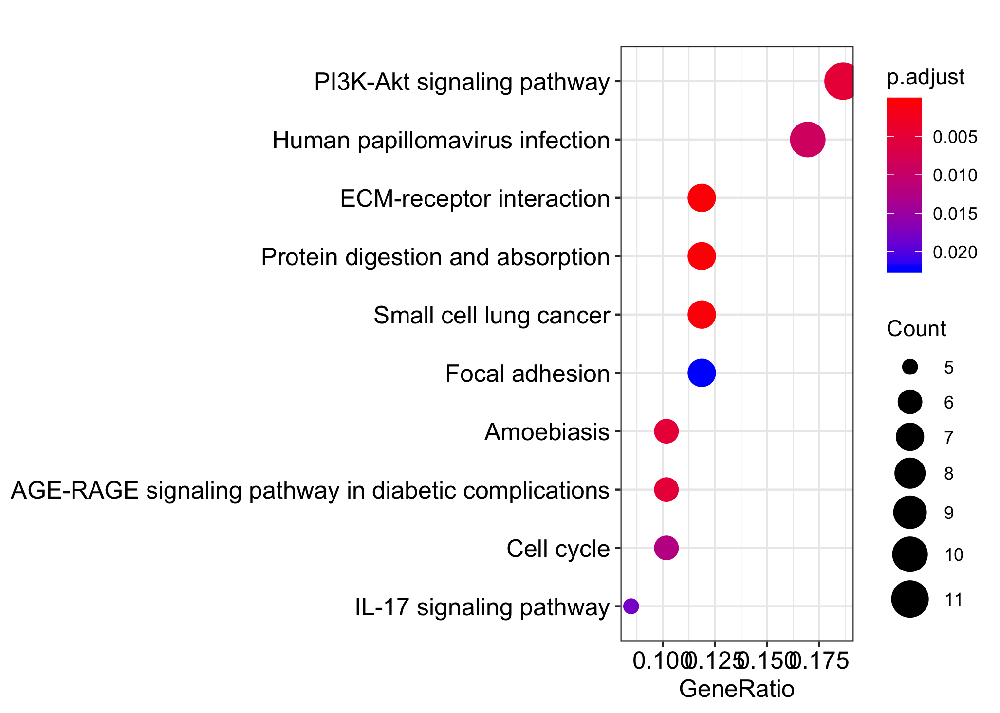
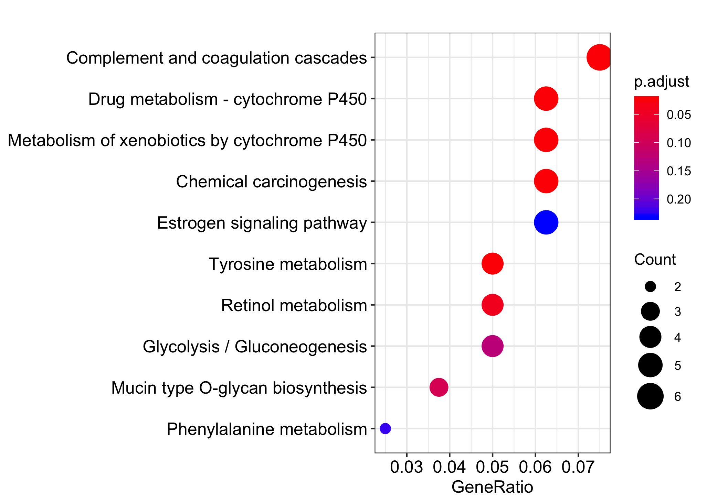
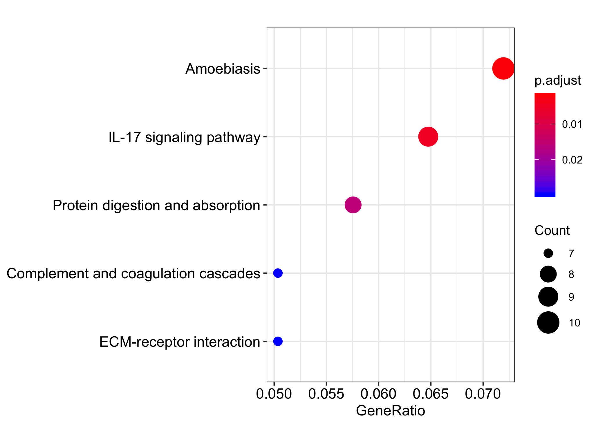

# 标准的肿瘤芯片差异分析

数据集是：GSE12452 ，关于NPC的探索，鼻咽癌

下载数据集，看临床表型，是10个正常组织的对照，和31个NPC肿瘤组织的表达数据。

### 检查表达矩阵

根据表达量看PCA图，说明肿瘤样品和正常对照不同组区分的很好

 

同理，取SD值最大的1000个基因绘制热图，应该也可以得到同样的模，,肿瘤样品和正常对照不同组区分的很好

一般来说，对芯片表达矩阵，都是走limma得到差异分析结果，火山图如下：

### KEGG数据库注释

得到上下调基因后通常做一个KEGG数据库注释

可以看到上调基因集中于下面这些KEGG通路：

可以看到下调基因集中于下面这些KEGG通路：

可以看到上下调综合的差异基因集中于下面这些KEGG通路：

 

可以看到上下调基因分开做富集分析，是有意义的。

### 后续高级注释

包括GO数据库超几何分布检验，GSEA, GSVA分析，这里略过。