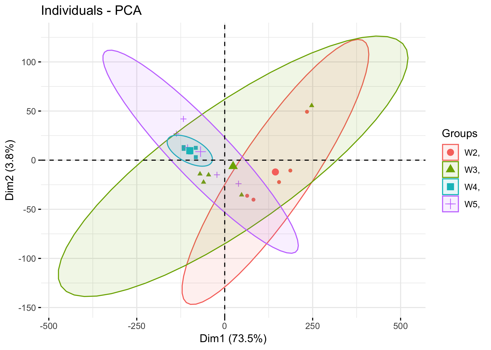

# GSE94016 数据集-动态网络生物标记物算法实现

首先花费3个小时阅读原文查看作者收据设计及分析流程: 

复旦大学附属中山医院肝肿瘤内科夏景林教授与中科院细胞生化所陈洛南研究员课题组进行合作，**首次成功鉴定肝癌肺转移发生前的临界阶段，发现原发性肝癌肺转移存在骤变拐点，并首次报道了钙离子传导蛋白（calmodulin-like-protein，简称CALML3）可抑制肝癌生长和肺转移。**相关研究成果于2月14日以“Dynamic network biomarker indicates pulmonary metastasis at the tipping point of hepatocellular carcinoma”为题在线发表于《自然·通讯》（Nature Communications）上。

原发性肝癌素有癌王之称，是我国乃至全球的高发恶性肿瘤之一。转移复发是影响生存率的关键因素，早发现早干预成为了攻克肝癌转移研究的难点和热点之一。肺是肝癌转移最常见的部位。肝癌肺转移的发生过程及其机制尚不明确。

课题组利用高转移人肝癌裸鼠模型，采用全基因组转录表达谱芯片，测定肝癌肺转移不同阶段的基因变化，利用原创性的动态网络生物标记物（Dynamic network biomarker，简称DNB）方法，发现肿瘤移植后第3周是肝癌肺转移发生的临界阶段，并成功鉴定具有“早期预警价值”的DNB核心基因。为了深入探讨DNB核心基因在促肝癌肺转移发生的作用机制，课题组进一步鉴定到DNB中起重要作用的CALML3，对其在肝癌肺转移中的作用及临床预后价值进行深入研究。

### Whole-genome expression profile

实验细节这里就不介绍了，芯片自己官网学习即可。

Raw data were normalized by robust multiarray analysis **(RMA)** algorithm, Gene Spring Software 11.0 (Agilent technologies). 

All microarray data were deposited in the Gene Expression Omnibus database (<http://www.ncbi.nlm.nih.gov/geo/>) Accession Number GSE94016.

To identify DEGs, we compared gene expression intensities among samples at two different time points using **Welch’s *t*-test with two-tailed *P*-value < 0.05**, which was adjusted by FDR for multiple testing.

通常我们默认作者对其芯片处理是准确的，所以直接下载其表达矩阵即可。

作者鉴定到的差异基因数量有点多，是13,247 differentially expressed genes (DEGs) by multiple comparisons with false discovery rate (FDR) adjustment (*P* < 0.05; Supplementary Data [1](https://www.nature.com/articles/s41467-018-03024-2#MOESM4)).  

聚类分析发现4个时间点的样本(W2, W3, W4, W5)可以粗浅的分成2组：

- one primarily including all samples at the second week after orthotopic implantation, two samples at the third week and one sample at the fifth week; 
- the other including all samples at the fourth and fifth weeks (except W5-a) and three samples at the third week

### 检查数据

首先下载，然后PCA看一看

使用top1000的SD值的基因看看热图；

可以看到，这样的聚类其实是不符合我们需求的， 没有突出第W3这个时间段是一个关键节点，一个过渡节点。

### 后续分析

需要实现动态网络生物标记物（Dynamic network biomarker，简称DNB）算法。

### 高通量芯片数据通常也需要实验验证

体内外实验中发现，CALML3是一个抑癌基因，它对肝癌生长和肺转移有明显的抑制作用。在270例肝癌手术切除患者中114例CALML3表达阳性，而这些表达阳性的患者术后生存率显著高于156例CALML3表达阴性者，而且CALML3表达阳性复发转移率也显著低于表达阴性者。

